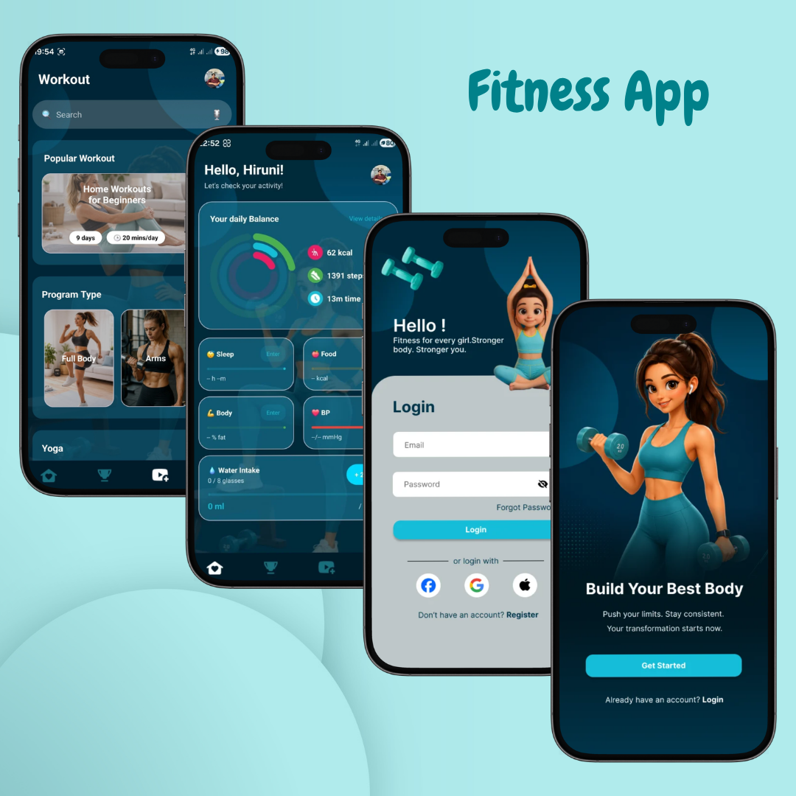

# 🏋️ Fitness-App – Android Fitness Tracking System

<p align="center">
  
</p>


---

## 🌟 Project Overview

**Fitness-App** is a native Android fitness tracking application designed to help users monitor daily physical activities, manage workout routines, and achieve personal health goals.

Users can track workouts, steps, calories, and water intake while following guided workout sessions with video support.

The system follows:

- 📱 Native Android Architecture (Kotlin + XML)
- 🎨 Material Design UI/UX
- 💾 Offline Local Data Storage
- 🏃 Workout Tracking System
- 🎥 Video-Based Workout Guidance

---

## 🌟 Key Features

## 🏠 Home Dashboard


- Personalized user greeting
- Circular progress tracking (Calories, Steps, Workout Time)
- Daily water intake tracking
- Fitness progress overview

---

## 💪 Workout Management


### Workout Categories

- Full Body Workouts
- Arm Workouts
- Leg Workouts
- ABS Workouts
- Yoga Sessions

### Features

- Browse workout programs
- Real-time search filtering
- Workout detail view
- Checklist-based workout completion
- Start workout sessions

---

## 🎥 Workout Video Player


- Built-in VideoView player
- Play / Pause controls
- Seek bar progress tracking
- Real-time workout timer
- “Up Next” workout preview system

---

## 🏆 Achievements System


### Achievements

- First Workout Badge
- 10 Workouts Completed
- 30-Day Streak
- Goal Reached Badge

### Tracking

- Personal best records
- Workout history timeline
- Daily progress tracking

---

## 👤 Profile Management


- Update personal details (Name, Height, Weight, Birthday)
- Activity level selection
- Profile image upload
- Global profile synchronization

---

## 🔒 System Architecture

## 📱 Frontend (UI Layer)

- XML-based layouts
- ConstraintLayout responsive design
- Material Design components
- Bottom navigation system
- Glassmorphism UI style

## ⚙️ Backend (Logic Layer)

- Kotlin business logic
- SharedPreferences local database
- File system storage (profile images)
- Intent-based navigation
- Handler + Runnable for video tracking
- TextWatcher for search filtering

---

## 🛠️ Tech Stack

| Layer | Technology |
|------|------------|
| Frontend | XML, Material Design |
| Backend | Kotlin |
| Database | SharedPreferences |
| Media | VideoView |
| Storage | Internal Storage (filesDir) |
| Architecture | Native Android |

---

## 📂 Project Structure

```plaintext
FITNESS_APP/
├── app/
├── java/
│   ├── HomeActivity.kt
│   ├── WorkoutActivity.kt
│   ├── WorkoutDetailActivity.kt
│   ├── StartWorkoutActivity.kt
│   ├── AchievementActivity.kt
│   └── ProfileActivity.kt
├── res/
│   ├── layout/
│   ├── drawable/
│   ├── values/
│   └── menu/
├── SharedPreferences
├── Internal Storage
└── AndroidManifest.xml
```

---

## 🚀 Getting Started

```bash
# Clone repository
git clone https://github.com/HiruniWijerathna/Fitness-App

# Open project in Android Studio

# Sync Gradle

# Run on emulator or device
```

---

## 🔗 Links

**💻 GitHub Repository:**  
https://github.com/HiruniWijerathna/Fitness-App  

**🎨 Figma Design:**  
https://www.figma.com/design/998YDDBCSn5W26vj7eETtx/Untitled?node-id=0-1&p=f&t=9h6T1qVgnaceVqL9-0  

---

## 🔮 Future Enhancements

- Firebase Authentication
- Cloud Sync
- Google Fit Integration
- AI Workout Suggestions
- Smart Calorie Prediction
- Push Notifications

---


## 📄 Conclusion

**Fitness-App** is a complete offline Android fitness tracking system that helps users manage workouts, track health metrics, and stay motivated through achievements and guided training sessions.
